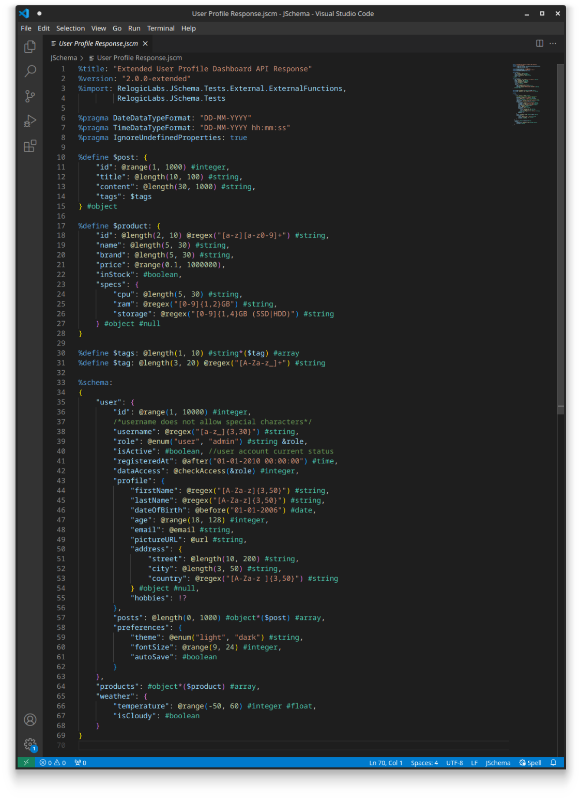

# JSchema - The Customizable JSON Schema
JSchema, a new JSON Schema, prioritizes simplicity, conciseness, and readability, making it intuitive and accessible without the need for extensive prior knowledge. It offers efficient read-write facilities, precise JSON document definition through various data types and functions, and extensibility to meet modern web service diverse requirements. To start your journey with JSchema library, please consult the documentation available for [C#](https://relogiclabs.github.io/JSchema-DotNet) and [Java](https://relogiclabs.github.io/JSchema-Java/articles/introduction).

## Features
This extension provides syntax highlighting support for JSchema and its supported file type `.jscm`

## Example

## Release Notes

* Initial release

**Enjoy!**